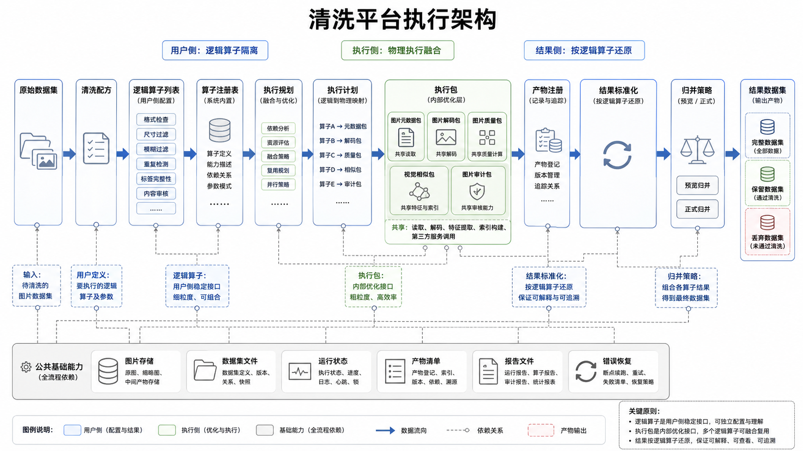
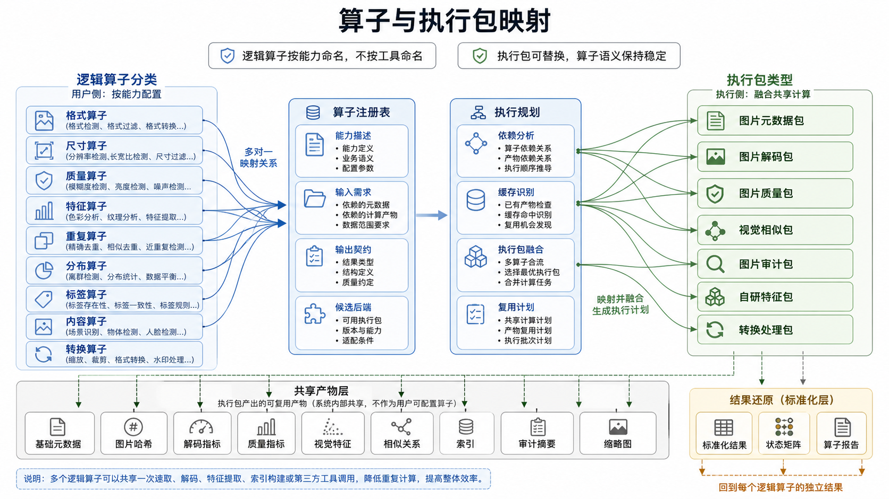

# 清洗平台与算子库架构

本文档从总架构文档中拆分而来，承接清洗平台与算子库的详细架构设计。总架构文档只保留总体把控、模块边界和跨模块约束。

## 模块定位

清洗平台负责基于 raw 原始数据集执行一组用户配置的逻辑清洗算子，记录每个逻辑算子的处理结果，并支持用户查看结果后再决定如何归并、过滤和导出数据集。

原先“每个逻辑算子都独立进行图片读取、解码和后端工具调用”的逐算子物理执行设计不再作为目标架构。该设计虽然简单，但会把逻辑算子隔离和物理执行隔离混为一谈，导致重复 I/O、重复解码、重复特征抽取、重复索引构建和重复第三方工具调用。

新的清洗平台采用以下核心原则：

```text
用户侧保持细粒度逻辑算子
执行侧允许把多个逻辑算子融合成物理执行包
结果侧仍然按逻辑算子输出标准化结果
```

清洗平台对用户暴露的是“要检查什么能力”，而不是“调用哪个后端工具”。OpenCV、fastdup、CleanVision、Data-Juicer、自研 embedding 或自研规则引擎都属于内部物理后端，不进入用户侧算子命名。

## 职责范围

1. CleaningRecipe 负责表达一次清洗流程的用户意图，包括输入数据集、输出位置、逻辑算子列表、归并策略和执行配置。
2. LogicalOperator 负责描述用户可见的细粒度清洗能力，例如格式检查、尺寸检查、模糊检测、亮度检测、近重复检测、离群检测和聚类分析。
3. OperatorRegistry 负责维护逻辑算子的元数据、输入需求、输出契约、默认决策规则和候选物理后端。
4. ExecutionPlanner 负责根据逻辑算子的需求、后端能力、缓存状态和执行配置生成物理执行计划。
5. ExecutionPack 负责真正调用内部算法或第三方工具，并把共享计算结果落盘为可追踪 artifact。
6. ResultNormalizer 负责把物理后端输出转换成逻辑算子的标准 node_result、node_status_matrix 和 node_report。
7. MergePolicy 负责读取多个逻辑算子的标准化状态矩阵，并生成 clean、dropped、full。
8. CleaningContext 负责保存 run_id、dataset_raw、逻辑算子配置、物理执行计划、产物引用、运行状态、报告摘要和配置快照。

## 核心对象

1. CleaningRecipe。
2. LogicalOperator。
3. OperatorRegistry。
4. ExecutionPlanner。
5. ExecutionPlan。
6. ExecutionPack。
7. ArtifactRegistry。
8. ResultNormalizer。
9. NodeResult。
10. NodeStatusMatrix。
11. NodeReport。
12. MergePolicy。
13. CleaningContext。

## 核心流程



上图表达清洗平台的领域执行链路：用户配置清洗配方和细粒度逻辑算子，系统通过算子注册表与执行规划生成执行包，执行后再按逻辑算子还原结果、状态矩阵和算子报告，最终由归并策略生成完整、保留、丢弃数据集。

```text
raw Dataset
  -> CleaningRecipe
  -> LogicalOperator 列表
  -> OperatorRegistry 能力匹配
  -> ExecutionPlanner 生成 ExecutionPlan
  -> ExecutionPack 物理执行
  -> ArtifactRegistry 记录共享产物
  -> ResultNormalizer 标准化逻辑算子结果
  -> node_result / node_status_matrix / node_report
  -> preview_merge / apply_merge
  -> clean / dropped / full
```

用户配置多个逻辑算子时，系统不要求每个逻辑算子都对应一次独立物理执行。多个逻辑算子可以共享一次图片读取、一次图片解码、一次 fastdup 运行、一次 CleanVision audit、一次 embedding 提取或一次 ANN 索引构建。

示例：

```text
quality.blur_check
quality.brightness_check
quality.contrast_check
  -> OpenCVQualityPack
     一次读取和解码图片，同时计算 blur、brightness、contrast 等指标

duplicate.near_duplicate_check
duplicate.outlier_check
duplicate.cluster_check
  -> FastdupVisualPack
     一次生成视觉特征和相似关系，同时产出近重复、离群和聚类结果
```

物理融合不得改变用户侧语义。用户仍然可以按逻辑算子查看命中图片、分数、阈值、原因、错误和建议动作。

## 数据 / 状态 / 配置契约

1. Recipe 配置包括 input_dataset、output_dir、logical_operators、merge_policy、execution_config、resume、overwrite、report_config。
2. LogicalOperator 配置包括 operator_id、operator_type、operator_config、decision_config、required_inputs、produced_outputs、backend_preferences。
3. ExecutionPlan 包括 pack_list、pack_dependencies、operator_to_pack_mapping、artifact_reuse_plan、result_normalization_plan。
4. ExecutionPack 配置包括 pack_id、pack_type、backend_name、backend_version、input_requirements、output_artifacts、batch_config、stage_config。
5. 运行状态保留 cleaning_run、operator_run、pack_run、batch_run、stage_run 和 artifact。
6. 每个逻辑算子必须输出 node_result、node_status_matrix 和 node_report。
7. 最终 clean、dropped、full 只能由 MergePolicy 根据逻辑算子的状态矩阵生成。

## 与其他模块边界

1. 清洗平台复用 storage、dataset、schemas、state、reports 等公共能力。
2. 清洗平台不复用通用顺序执行循环；清洗领域有自己的 Recipe、Plan、Pack 和 ResultContract。
3. LogicalOperator 不直接修改 Dataset，不直接生成 clean、dropped、full。
4. ExecutionPack 不对用户暴露为算子，不决定最终过滤结果。
5. 数据集可视化模块只读取 Dataset、逻辑算子结果、状态矩阵、物理执行报告和 artifact 摘要，不修改清洗结果。
6. 错误处理与恢复模块负责状态存储、artifact manifest、配置兼容性和恢复校验约定。

## 目标范围与非目标

目标范围：

1. 细粒度逻辑算子配置。
2. 逻辑算子注册表和能力描述。
3. 物理执行计划生成。
4. 算子包融合执行。
5. 共享 artifact、缓存和特征复用。
6. node_result、node_status_matrix、node_report 标准输出。
7. preview_merge、apply_merge、export_dataset。
8. 基础格式、尺寸、质量、重复、离群和聚类能力。

非目标：

1. 让用户直接配置 OpenCV、fastdup、CleanVision 这类工具名称作为主要算子模型。
2. 让物理执行包直接替代逻辑算子的结果查看和归并语义。
3. 在检测类算子中直接修改图片资产。
4. 把 clean、dropped、full 建模为物理执行包的副作用。
5. 把大规模图片级明细写入 SQLite。

## CleaningRecipe 设计

CleaningRecipe 表达一次清洗流程的用户意图。Recipe 面向用户、Notebook、配置文件和后续服务端 API 保持稳定。

Recipe 负责表达：

1. 输入 Dataset。
2. 输出目录或输出存储位置。
3. 逻辑算子列表。
4. 每个逻辑算子的业务参数和决策参数。
5. 执行模式，例如 debug、optimized、backend_preference。
6. 归并策略。
7. 报告配置。
8. resume 和 overwrite 策略。

Recipe 不负责表达：

1. 具体调用哪个第三方工具。
2. 多个算子如何融合。
3. 中间 artifact 如何命名和复用。
4. 物理执行阶段如何拆分。

## LogicalOperator 设计

LogicalOperator 是用户配置、结果查看、过滤解释和归并输入的基本业务单元。

每个 LogicalOperator 需要声明：

```text
operator_id
operator_type
category
granularity
required_inputs
produced_outputs
operator_config
decision_config
backend_candidates
cache_key_fields
result_contract
```

granularity 建议使用：

```text
image
pairwise
dataset
label_aware
transform
```

示例：

```text
quality.blur_check:
  granularity: image
  required_inputs: decoded_image
  produced_outputs: blur_score, is_blurry
  backend_candidates: opencv_quality_pack, cleanvision_audit_pack

duplicate.near_duplicate_check:
  granularity: dataset
  required_inputs: visual_embedding_index
  produced_outputs: duplicate_group_id, nearest_neighbor_id, similarity_score
  backend_candidates: fastdup_visual_pack, custom_embedding_pack
```

LogicalOperator 负责：

1. 表达用户可见的清洗能力。
2. 声明输入需求和输出契约。
3. 声明默认决策规则。
4. 声明候选后端和缓存关键字段。
5. 接收标准化后的结果并形成逻辑算子视角的 node_result、node_status_matrix 和 node_report。

LogicalOperator 不负责：

1. 直接读取图片和调用第三方工具。
2. 决定多个算子如何融合执行。
3. 管理整个清洗流程生命周期。
4. 修改 dataset_raw。

## ExecutionPlanner 设计

ExecutionPlanner 把逻辑算子列表转换为物理执行计划。Planner 不是用户心智模型，而是运行时优化层。

Planner 输入：

1. CleaningRecipe。
2. OperatorRegistry。
3. Dataset fingerprint。
4. 已存在 artifact 和缓存索引。
5. 执行配置和后端偏好。

Planner 输出：

1. ExecutionPlan。
2. operator_to_pack_mapping。
3. artifact_reuse_plan。
4. result_normalization_plan。

Planner 需要处理：

1. 将共享 decoded_image 的局部质量算子合并到同一个图片质量执行包。
2. 将共享 visual_embedding_index 的近重复、离群、聚类和相似检索算子合并到同一个视觉相似度执行包。
3. 识别可以复用的 hash、metadata、embedding、index、fastdup artifacts、CleanVision issue summary。
4. 在 debug 模式下允许逻辑算子独立执行，便于单测和问题定位。
5. 在 optimized 模式下优先融合执行，降低 I/O 和重复计算。

Planner 不应改变逻辑算子的最终输出语义。即使多个逻辑算子被融合执行，也必须能追踪每个逻辑算子对应的结果、错误、报告和状态。

## ExecutionPack 设计

ExecutionPack 是物理执行单元。一个 Pack 可以服务一个或多个 LogicalOperator。



上图表达逻辑算子和执行包的映射关系：逻辑算子按能力分类并保持用户侧稳定，执行规划把可共享输入、特征、索引或后端调用的算子融合到执行包中，执行包产出的共享产物再经过结果标准化回到每个逻辑算子的独立结果。

候选 Pack：

1. ImageMetadataPack：读取图片头信息、校验格式、生成基础宽高和格式信息。
2. ImageDecodePack：受控读取和解码图片，向下游质量计算提供 decoded_image。
3. OpenCVQualityPack：计算模糊、亮度、对比度、灰度、纯色、基础清晰度等局部质量指标。
4. FastdupVisualPack：生成视觉特征和相似关系，产出近重复、离群和聚类相关 artifact。
5. CleanVisionAuditPack：一次 audit 产出多个图片问题类型。
6. DataJuicerRecipePack：把一组 Data-Juicer 能力作为物理后端执行。
7. CustomEmbeddingPack：生成自研 embedding、ANN index 和相似关系。
8. CustomTransformPack：执行会生成新图片资产的转换类能力。

ExecutionPack 负责：

1. 读取 Dataset 或上游 artifact。
2. 调用内部算法或第三方工具。
3. 写出共享 artifact、指标表、关系表、报告和错误摘要。
4. 更新 pack_run、stage_run、batch_run 和 artifact 状态。
5. 向 ResultNormalizer 提供可解释的后端输出。

ExecutionPack 不负责：

1. 暴露为用户侧算子名称。
2. 直接生成 clean、dropped、full。
3. 覆盖逻辑算子的决策规则。
4. 隐藏后端错误导致逻辑算子无法解释结果。

## 执行模式

清洗平台支持三类执行模式：

1. debug：每个逻辑算子尽量独立执行，优先可解释性、单测便利性和问题定位。
2. optimized：默认生产模式，Planner 自动融合可共享 I/O、解码、特征、索引和第三方工具调用的逻辑算子。
3. backend_preference：高级配置允许用户指定能力类别的偏好后端，例如 image_quality 使用 opencv，visual_similarity 使用 fastdup。

backend_preference 不应要求用户把所有算子按工具重新命名。用户仍然配置 `quality.blur_check`、`duplicate.near_duplicate_check` 这类能力算子。

## Artifact 与缓存设计

共享中间产物是清洗平台性能优化的关键。以下产物应由 ArtifactRegistry 统一管理：

1. 图片基础元数据。
2. 图片 hash。
3. 解码派生指标。
4. 质量指标。
5. 视觉 embedding。
6. ANN index。
7. fastdup artifacts。
8. CleanVision issue summary。
9. Data-Juicer 中间输出。
10. 缩略图和抽样报告素材。

artifact 需要携带以下可复用性字段：

```text
dataset_fingerprint
image_content_hash
operator_config_hash
backend_name
backend_version
code_version
artifact_schema_version
created_at
```

当用户新增逻辑算子但输入数据、后端配置和版本未变化时，Planner 应优先复用已有 artifact，并只执行缺失的标准化或归并步骤。

## 批处理与硬盘卸载

清洗平台需要面向十万级、百万级图片数据集设计。系统不假设所有数据集、执行包产物、逻辑算子结果或状态矩阵都可以放入内存。

默认处理策略：

1. dataset_raw、pack_artifact、node_result、node_status_matrix、node_report、merge_result、clean、dropped、full 等主产物都应落盘或写入对象存储。
2. CleaningContext 只保存产物引用、运行状态和必要摘要。
3. batch 型 Pack 按 batch 读取 dataset_raw，内存中只保留当前 batch 的图片对象和临时计算结果。
4. staged 型 Pack 先分批生成中间结果，再执行全局阶段计算。
5. Pack 和逻辑算子结果都需要通过 manifest 原子提交。

产物建议采用以下目录组织：

```text
cleaning_outputs/
  {run_id}/
    plans/
      execution_plan.json
    packs/
      {pack_id}/
        artifacts/
        pack_report.json
    logical_operators/
      {operator_id}/
        node_result/
          part-00000.parquet
          part-00001.parquet
        node_status_matrix/
          part-00000.parquet
          part-00001.parquet
        node_report.json
```

## 结果存储格式

逻辑算子结果和状态矩阵建议使用 Parquet 存储。

node_status_matrix 建议采用逻辑算子级窄表结构，而不是跨算子大宽表。每个逻辑算子维护自己的状态矩阵，归并时再按需读取多个逻辑算子结果。

```text
node_status_matrix:
  schema_version
  run_id
  operator_id
  operator_type
  pack_id
  backend_name
  backend_version
  image_id
  status
  suggested_action
  reason
  score
  threshold
  params_hash
  artifact_refs
  error_code
  error_message
  processed_at
```

status 建议使用：

```text
passed
flagged
failed
skipped
```

suggested_action 建议使用：

```text
keep
review
drop
restricted
```

node_result 用于保存逻辑算子特有结果，也建议优先使用 Parquet。复杂统计报告、运行摘要和错误概览可以使用 JSON。

示例：

```text
quality.blur_check:
  node_result: image_id, blur_score, backend_name, artifact_ref
  node_status_matrix: image_id, status, suggested_action, reason, score, threshold

duplicate.near_duplicate_check:
  node_result: group_id, image_id, representative_image_id, similarity_score, relation_artifact_ref
  node_status_matrix: image_id, status, suggested_action, reason, group_id
```

对于跨图片关系，建议保留独立 relation 产物：

```text
image_relations:
  schema_version
  run_id
  operator_id
  source_image_id
  target_image_id
  relation_type
  score
  group_id
  backend_name
  artifact_refs
```

## 归并、查看与导出

归并、状态查看和数据集导出属于清洗平台的领域函数，不作为普通 LogicalOperator 或 ExecutionPack 建模。

清洗平台提供以下领域函数：

1. run：根据 Recipe 生成计划、执行 Pack、标准化逻辑算子结果。
2. plan：只生成 ExecutionPlan，不执行。
3. run_pack：执行指定物理执行包。
4. rerun_operator：在必要时重新生成某个逻辑算子的标准化结果，并按需触发相关 Pack。
5. get_status：查看 run、Pack 和逻辑算子的运行状态。
6. get_operator_result：查看某个逻辑算子的独立处理结果。
7. get_operator_status_matrix：查看某个逻辑算子的独立状态矩阵。
8. get_artifacts：查看物理执行包和共享中间产物。
9. preview_merge：基于指定策略预览 clean、dropped、full 结果，但不生成正式结果版本。
10. apply_merge：基于指定策略生成正式归并结果版本。
11. export_dataset：将指定归并结果导出为训练或分析可用的数据集文件。

## 归并策略

归并策略用于把多个逻辑算子的处理结果转化为 clean、dropped、full 数据集。

归并策略可以包含：

1. 启用哪些逻辑算子结果。
2. 是否采用某个逻辑算子的 suggested_action。
3. 不同 suggested_action 的优先级。
4. keep、review、drop、restricted 等动作的处理规则。
5. 重复图片分组中的保留策略。
6. 需要写入输出数据集的字段范围。
7. 多个 reason 的聚合方式。
8. 确定性排序规则和 merge_policy_hash。

同一批 node_results 和 node_status_matrices 可以应用多套归并策略，生成多个 merge_result 版本。归并结果不应覆盖原始逻辑算子结果和物理执行 artifact。

clean、dropped、full 最小字段：

```text
schema_version
merge_result_id
merge_policy_hash
image_id
image_uri
final_status
final_action
final_reason
triggered_operator_ids
source_row_ref
```

dropped 必须保留 final_reason 和 triggered_operator_ids。full 必须包含全部样本，clean 与 dropped 的行数之和必须等于 full 行数。

## 算子注册与加载

清洗平台不应硬编码所有清洗算子。逻辑算子通过 OperatorRegistry 管理。

算子对外按功能分类和命名，不按底层工具分类和命名。CleaningRecipe、operator_type 和用户配置应表达“要执行什么清洗能力”，而不是表达“使用哪个开源工具”。

对外 operator_type 示例：

```text
format.decode_check
size.dimension_check
quality.blur_check
quality.brightness_check
quality.contrast_check
duplicate.near_duplicate_check
duplicate.outlier_check
duplicate.cluster_check
content.blank_image_check
```

底层工具来源作为 ExecutionPack 的内部实现策略存在，可以由 Planner 默认选择，也可以在 execution_config 中配置后端偏好。例如 `duplicate.near_duplicate_check` 可以由 fastdup 执行，也可以后续切换为自研 embedding 检索实现，而不改变对外 operator_type。

OperatorRegistry 负责：

1. 维护 operator_type 与 LogicalOperatorSpec 之间的映射关系。
2. 支持按功能分类查询可用算子。
3. 支持 Planner 根据输入需求和输出契约选择候选 ExecutionPack。
4. 支持后续扩展新的逻辑算子。
5. 支持平台展示当前可用算子及其配置说明。

## 算子功能分类

逻辑算子按功能分类组织。功能分类是对外稳定边界，底层实现工具是内部实现细节。

建议支持以下功能分类：

1. format：格式、解码能力、文件损坏检查。
2. size：宽高、长宽比、最小尺寸和最大尺寸检查。
3. quality：模糊、亮度、对比度、噪声、灰度、纯色等质量指标检查。
4. feature：hash、embedding、颜色直方图、OCR 特征、水印特征等可复用特征。
5. duplicate：完全重复、近似重复和重复组检查。
6. distribution：离群、聚类、语义分布、类别分布异常等数据集级检查。
7. label：标签缺失、标签不一致、类内离群、类间近重复、疑似错标。
8. content：空白图、异常内容、合规风险等内容检查。
9. transform：格式转换、resize、压缩、去 EXIF、裁剪、水印清理、颜色空间转换。

检测类、过滤类和转换类需要保持边界清晰。检测类只产出分数、标记、关系和建议动作；归并策略决定最终过滤；转换类生成新图片资产，不应伪装成普通检测算子。

## 设计原则

1. 逻辑算子是用户侧稳定接口，物理执行包是内部优化接口。
2. 逻辑算子按能力命名，不按工具命名。
3. Planner 可以融合多个逻辑算子，但不得改变每个逻辑算子的结果查看、错误解释和归并语义。
4. ExecutionPack 可以共享读取、解码、特征、索引和第三方工具调用。
5. dataset_raw 在清洗过程中保持不可变。
6. LogicalOperator 只产生节点级处理结果和状态矩阵，不直接改变数据集。
7. clean、dropped、full 是归并策略的结果，而不是物理执行包的副作用。
8. 大规模产物默认落盘，CleaningContext 只保存引用和摘要。
9. SQLite 只保存控制面状态和 artifact 索引，不保存图片级大规模明细。
10. 后端工具可以替换，operator_type、result_contract 和 merge 语义必须保持稳定。
