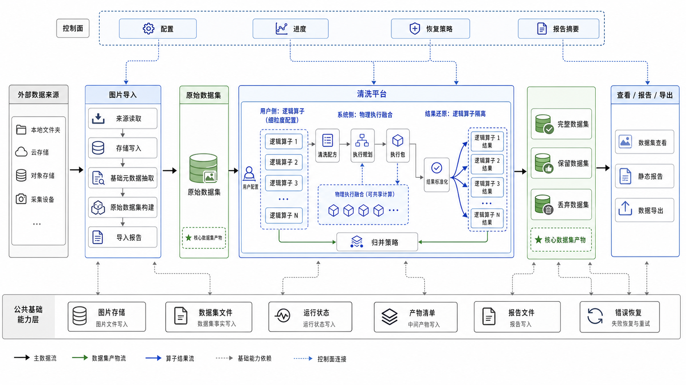

# 图片数据集处理框架技术架构

本文档是图片数据集处理框架的总架构入口，只保留总体方向、关键架构决策、模块索引和第一版实施顺序。各功能域的对象、流程、字段、状态、错误恢复和性能细节，以 `docs/architecture/modules/` 下的模块文档为准。

## 1. 总体定位

本项目第一版以 Python package 和 Jupyter 调试形态为主，目标是完成图片导入、统一存储、数据集文件、清洗算子、清洗结果查看和导出的本地闭环。

第一版不引入服务端、Web 前端、用户权限、分布式调度和完整数据集版本管理。系统设计应优先保证数据产物可追踪、清洗结果可解释、运行状态可恢复，并为后续平台化预留清晰边界。

## 2. 核心架构决策

1. 数据集优先：系统核心产物是 raw、full、clean、dropped 等可追踪 Dataset，而不是单次脚本运行结果。
2. 统一存储优先：外部图片导入后以 image_uri 作为图片主引用，source_uri 只用于追溯和审计。
3. Parquet 存数据，SQLite 存运行状态，图片存 Storage；图片标签作为 Dataset 字段保存。
4. 清洗平台不采用通用顺序编排模型，也不按逻辑算子逐个独立物理执行。
5. 用户侧坚持细粒度 LogicalOperator，执行侧通过 ExecutionPlanner 把可共享计算融合为 ExecutionPack。
6. ResultNormalizer 必须把物理执行结果还原为每个逻辑算子的 node_result、node_status_matrix 和 node_report。
7. clean、dropped、full 只能由 MergePolicy 基于逻辑算子结果归并生成。
8. 后端工具选择不暴露为用户侧算子命名；OpenCV、fastdup、CleanVision 等只作为内部后端或 adapter。

## 3. 总体数据流



上图表达第一版核心链路：外部图片导入为原始数据集，清洗平台在用户侧保持逻辑算子细粒度，在执行侧融合共享计算，最终生成完整、保留、丢弃数据集，并通过公共基础能力提供存储、状态、产物、报告和恢复支撑。

```text
外部数据来源
  -> 图片导入
  -> 平台统一存储
  -> raw Dataset
  -> CleaningRecipe
  -> LogicalOperator 列表
  -> ExecutionPlanner
  -> ExecutionPack 融合执行
  -> ResultNormalizer
  -> node_result / node_status_matrix / node_report
  -> preview_merge / apply_merge
  -> full / clean / dropped Dataset
  -> DatasetViewer / report / export
```

其中：

1. 图片导入负责生成 raw Dataset，不执行清洗算法。
2. 清洗平台负责 Recipe、Plan、Pack、结果标准化、结果查看和归并。
3. 可视化和报告只读取结果，不改变清洗结论。
4. Storage、Dataset、State、Reports 是跨模块复用的基础能力。

## 4. 模块索引

详细设计按模块维护，总架构不重复展开。

1. [图片导入与元数据](modules/图片导入与元数据.md)：外部来源读取、平台统一存储写入、基础元数据抽取、raw Dataset 和导入报告。
2. [数据集管理与可视化](modules/数据集管理与可视化.md)：Dataset 读写、预览、扫描、导出、Notebook 查看和静态 HTML 报告。
3. [清洗平台与算子库](modules/清洗平台与算子库.md)：CleaningRecipe、LogicalOperator、ExecutionPlanner、ExecutionPack、ResultNormalizer、MergePolicy 和算子注册。
4. [存储系统](modules/存储系统.md)：image_uri、文件系统和 MinIO 等具名存储库。
5. [错误处理与恢复](modules/错误处理与恢复.md)：错误分类、Run State Store、artifact manifest、原子提交、resume 和 rerun。
6. [性能与扩展](modules/性能与扩展.md)：批处理、分片、I/O 控制、ExecutionPack 融合、artifact 复用和规模边界。

## 5. 模块边界

### 5.1 图片导入

图片导入模块只负责把外部图片变成平台内可追踪 raw Dataset。它可以记录 import_run、import_progress、import_artifact 和 import_failed_summary，但不依赖额外编排层。

### 5.2 存储与数据集

storage 负责地址和对象读写，dataset 负责数据集文件读写和导出。两者不理解清洗业务语义，也不决定 raw、clean、dropped、full 的归并规则。

### 5.3 清洗平台与算子库

cleaning 负责清洗流程编排和结果归并，operators 负责逻辑算子规格和候选执行后端。LogicalOperator 面向用户稳定，ExecutionPack 面向内部执行优化。

### 5.4 状态、报告与可视化

state 只保存控制面状态和 artifact 索引；reports 保存报告摘要和报告文件；visualization 只读取 Dataset、逻辑算子结果、状态矩阵、物理执行报告和归并结果。

## 6. 技术选型总览

第一版优先选择成熟、轻量、易调试、可替换的 Python 生态工具。

1. 数据集文件：优先 PyArrow / Parquet，Notebook 展示可使用 Pandas。
2. 图片处理：优先 Pillow 和 OpenCV，fastdup、CleanVision 等作为可选后端接入。
3. 存储接入：本地文件系统和 MinIO。
4. 运行状态：SQLite，避免引入复杂 ORM。
5. 配置：优先 Python dict / dataclass，YAML、pydantic 后续按需引入。
6. 可视化：Notebook、缩略图和静态 HTML，不引入前端框架。

第一版暂不引入 FastAPI、PostgreSQL、Milvus、Weaviate、Celery、Airflow、Prefect、Web 前端和分布式计算框架。

## 7. 代码结构总览

建议包名保持为 `image_gallery`。

```text
ImageGallery/
  docs/
    prds/
    architecture/
      modules/
  notebooks/
  examples/
  src/
    image_gallery/
      config/
      storage/
      dataset/
      schemas/
      state/
      importers/
      cleaning/
      operators/
      visualization/
      reports/
      utils/
  tests/
    unit/
    integration/
    fixtures/
```

代码结构原则：

1. 不再保留通用流程编排目录或通用节点抽象。
2. `storage`、`dataset`、`schemas`、`state` 是公共基础能力。
3. `importers`、`cleaning`、`operators`、`visualization`、`reports` 按领域边界组织。
4. `examples` 和 `notebooks` 只使用公开 API。
5. `utils` 只放真正跨模块复用的小工具。

## 8. 开发顺序

第一版开发顺序围绕“先数据闭环，再清洗架构，再可视化验收”展开。

1. 公共基础能力：建立包结构、storage、schemas、dataset、state 和 artifact manifest。
2. 图片导入闭环：实现本地目录和已有数据集导入，写出 raw Dataset、import_report 和 failure_manifest。
3. 清洗核心模型：实现 CleaningRecipe、LogicalOperatorSpec、OperatorRegistry、ExecutionPlanner、ExecutionPack 和 ResultNormalizer。
4. 第一批算子与归并：实现 format、size、quality 的基础逻辑算子，完成至少一个可融合 ExecutionPack，并支持 preview_merge、apply_merge、clean、dropped、full。
5. 查看、报告与恢复：实现 DatasetViewer、Notebook 图片网格、静态 HTML 报告、resume、overwrite、rerun_operator 和 rerun_pack。
6. 验收固化：补齐小样本集成测试、十万级规模边界验证、公开 API 示例和 Notebook 验收流程。

## 9. 第一版验收口径

第一版验收以完整本地链路为准：

1. 能从本地目录导入图片，写入统一存储，并生成 raw Dataset。
2. 能通过 Dataset 读取、预览、扫描、导出和 fingerprint 数据集。
3. 能配置 CleaningRecipe 和逻辑算子列表。
4. 能生成 ExecutionPlan，并把至少两个共享解码或质量指标的逻辑算子融合到同一个 ExecutionPack。
5. 能为每个逻辑算子生成独立 node_result、node_status_matrix 和 node_report。
6. 能导出 full、clean、dropped，且 clean + dropped = full。
7. 能查看丢弃原因、异常样本、重复组或 dropped 候选。
8. 能记录失败清单、错误摘要、运行状态和 artifact manifest。
9. 能在中断后基于 SQLite 状态和 artifact manifest 恢复运行。
10. 不依赖服务端 API 和 Web 页面即可完成核心流程。

## 10. 非目标与演进

第一版不包含：

1. FastAPI 服务、Web 前端、多用户权限和 PostgreSQL。
2. 图片增强、标注协同、数据集版本管理、分支与合并。
3. 跨机器分布式调度、复杂成本优化器和跨集群调度器。
4. 外部向量检索服务和生产级 NSFW、隐私识别、语义重复模型。
5. 所有算子的百万级生产性能承诺。

后续演进方向：

1. 增强 ExecutionPlanner 的成本模型、依赖分析和并行调度能力。
2. 将重型算子拆成独立插件包或 extras。
3. 引入 DuckDB、Polars LazyFrame 或向量索引用于更强 result_view 和检索能力。
4. 增加服务端 API、Web 页面、权限、审计和团队协作能力。
5. 增加图片增强、数据集版本管理、数据集 manifest 和数据治理能力。

## 11. 兼容原则

1. LogicalOperator 的 operator_type 对用户稳定，底层 ExecutionPack 和后端实现可以替换。
2. image_uri 是图片级数据集的唯一主地址字段，V1 不再同时维护 storage_path 和 resolved_uri。
3. raw Dataset 使用 tags 字段保存路径型层级标签列表，例如 `scene/kitchen/cook`。
4. schema_version 必须随 Dataset 和节点产物写出。
5. clean、dropped、full 的最小字段契约应向后兼容。
6. 后续 Planner 优化不应破坏逻辑算子的结果查看、错误解释和归并语义。
7. 后续服务端和 Web 只能包装 Python 包公开 API，不应绕过 Dataset、Storage、State、Cleaning 和 Operator 契约。
